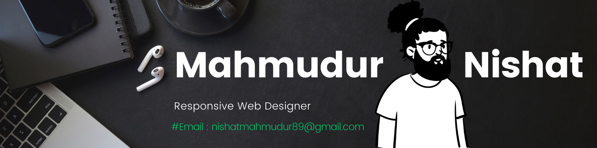

<h1 align="center">Hi🙋🏾‍♂️There, Welcome To My 👑Github-KingDom👑</h1> 
<h3 align="center">Here, My role 🗣️ In Every Project , I Will Give My 101% </h3>

- 🔗I Trust | Allah | Then | Dedication | Hardwork | Discipline | Passion | = Sucess
- 🔭 This Year < Mission 2024 = "👑Mern-Stack-Developer👑" >
- 🔭 I’m currently working on **Responsive Web Design Project**
- 🌱 I’m currently learning **Modern-Javascript**
- 👨‍💻 You Can Travel All My Kingdom -- [https://github.com/Mahmudur-Nishat](https://github.com/MahmudurNishat?tab=repositories)
- 💬 Ask me about **Responsive Web designer**
- 📫 How to reach me **nishatmahmudur89@gmail.com**
- ⚡ Fun fact **I'm a chill person who's always in a good mood, but when it comes to work, I'm super hardworking and focused.**

## <h3 align="left">Connect with me: <a href="https://www.linkedin.com/in/mahmudur-nishat/" target="blank">🔗 Linkedin 🔗 </a></h3>

<h3 align="left">Languages and Tools:</h3>

- 🔭 Languages : Html , CSS , Responsive Web Design , Bootstrap , Tailwind

- 🌱 Learning Queue : Modern javascript

- 👨‍💻 Tools : Figma , Adobe Photoshop , Canva , Adobe PremirePro , WonderShareFilmora .
